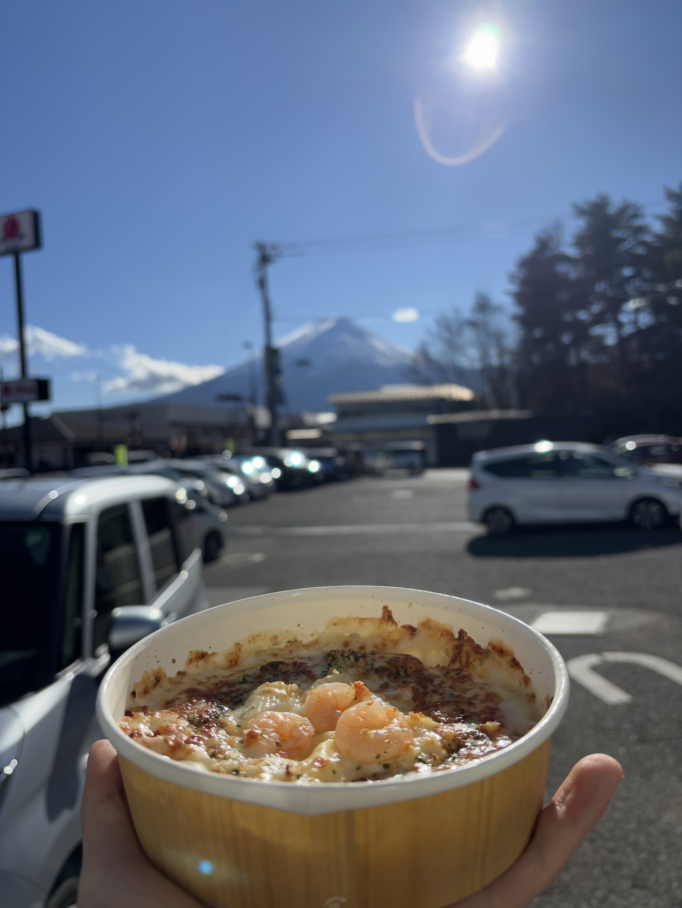

## 前往河口湖：小田急-富士回游
- 9点新宿的车票我是8点起的，看小田急十分钟就到新宿了我以为时间很充裕，但是实际上我告别玉彬出门的时候已经8点半了。看着地铁站门口的罗森，我决定到了新宿再买早饭。事实证明这是错误的决定——新宿站太大了我把握不住啊，到了之后因为不敢乱走所以只好去离站台最近的店里买了一个三文鱼三明治
- 很开心，我边上的座位一直是空的，所以箱子放的很舒服~
- 富士回游线有10个车厢，前三个车厢是去往河口湖的，后面七个车厢好像是去往松本的，开到一半会在大月分开各跑各的。另外挺神奇的一点在于快到的时候，在富士山站车会掉头，是一个人字形的铁轨，从富士山站出来会车头变车尾
- 我的作为在左侧，在列车掉头之前一直面对的是富士山的方向，不过前面大半程也看不到的啦。过了大月之后，就可以渐渐地看到越来越多的富士山了！当然换向之后富士山就在另一侧了，不过没关系，这两天富士山可以看个够）
- 河口湖站本身不大，但是人流量很大，大家都不远千里跑来玩。出了车站往左一走立马就可以看到小红书上的网红罗森店很多游客在打卡拍照，我觉得太网红了所以随手拍了一张就直接去找民宿去了。这处打卡点因为游客太多影响到了当地居民的生活所以之前还拉起来了黑幕故意破坏掉风景让游客不要来拍照，ε=(´ο｀*)))唉
## 湖畔骑行
### 入住民宿
- 走去民宿的路要15min左右，我在地图上看觉得还挺近的，拎着箱子走起来实际还挺远的。可能是因为这是一座小城，所以没走多远就开始感觉偏僻冷清，以为自己走了很远很远。路非常窄，感觉基本只容一辆车通行，需要错车的时候就需要去别人家院子或者车库借一下位，还好我没有在日本租车
- 民宿非常非常干净，房东大姐姐Wakoh人也很好。实在是太喜欢这家民宿了所以来保存一下链接以防下次再来[Airbnb链接](https://zh.airbnb.com/rooms/953339433254865723?check_in=2025-02-08&check_out=2025-02-13&guests=1&adults=1&s=67&unique_share_id=89a704f0-0c60-4918-bec1-49aaa1b123a8) 。房间是一间榻榻米的房间，我之前没有住过榻榻米，只在哆啦A梦啊、三坪房间的侵略者啊里面看到过，以为是黄黄的一大块。今天近距离观察了一下才发现原来表面是很平的一张席子，河里起来了
- 房东还提供自行车。助力车租一天要3000日元，比外面的店看起来要贵一些，外面大概是2600左右吧。不过再仔细看看小红书发现很多地方要排队或者车子租完了，以及外面租车时间会卡的很死，所以还是在房东大姐姐这里租吧，很省心还有售后，跟她知会了一下晚几个小时还也没有关系，嘻嘻
### 午饭：全家！
- 准备出门的时候已经12点半了，我还问了问房东大姐姐附近有什么好吃的有什么好的温泉，她非常贴心地给我分享了一个很丰富的google map的列表，还推荐了我一会吃午饭的地方。结果我出门骑过去才发现，这家叫彩花的面馆前面已经排了大长队，让我望而却步。于是我就去了下一个看上去也很不错的拉面店ほうとう蔵歩成，然后发现排队等位预计时间一个半小时……我就应该老老实实在彩花那里等的……
- 之所以不想排队等是因为我看小红书上说骑车绕湖一周要三四个小时，而当时我出门已经12点半了。加上4点半日落，如果我再等等感觉时间就很紧张了。所以最后来河口湖吃的第一顿饭是经典全家フェミチキ和意面便当。。。
  
- 因为找饭吃基本上大方向是按绕湖顺时针方向走的，所以我就干脆一直顺时针走了。不过或许这不是一个好的主意，因为日本靠左行驶，这样的话每次拍照都要过马路，比较麻烦，可能还是逆时针转比较好。
### 绕湖
- 整个绕湖的过程中，我一直是相机挂在脖子上的，虽然有点危险一旦摔一下的话可就不止是肉疼了，还要心疼相机了，呸呸呸摸木头。但是随手可以拍照真的很方便，停下来就可以拍然后立刻就能继续，我甚至还一边骑一边端相机，当然也是因为没什么车所以比较狂了。这两天我一直是这个装扮，从河口湖玩到富士吉田全是边骑边拍
- 接下来是不是要流水账了呢。。第一站停下来的地方是八木崎公园。这个公园看上去没有充斥着游客，一片安静祥和的景象，可能是因为是在南岸看不到河口湖中的富士山吧。小土丘上铺满了金黄色的草地，草地上有带着一两个小朋友和小狗的本地家长，蜿蜒在草地之间小路上有几个老人在边晒太阳散步边聊闲天，在金黄的草地和深蓝的湖水交界之处长着几簇虽然有些枯黄但是不乏生机的芦苇。感觉如果就这样坐在湖边度过闲暇的时光，也挺好的
- 从八木崎公园出来刚走两步，就看到了一个Muse Museum。我以为是介绍河口湖的博物馆之类的，不过其实更像是礼品店，但是在这里找到了一个章。这次我记得带手账本了，就让这个章成为开启我这次盖章之旅的第一枚印章吧！这套印章总共有八个，不过分散在了富士五湖周围，想要收集全就太难了，就先盖这一个吧
- 沿着湖边看风景边继续走，很快走到了一家小神社的门口，「冨士御室浅間神社」。进去看了看没有找到盖章的地方，于是我想用绘马的笔在我的手账本上签个名的，但是可惜太难用了，最后只好作罢。说起来好玩的是，我当时直接写了”富士浅間神社“，但是我后面一天去了富士吉田我才知道，原来这边的神社都叫富士浅间神社。。神社里有武田信玄的祈愿所，难得看到一个我认识的名字，不知道和这里有什么渊源呢
- 其实后面也没有什么特别值得浓墨重彩提到的地点了。随走随拍，随骑随看，芦苇、湖面、阳光、渔舟，自行车、汽车、野营地、自动售货机。渐渐地从湖的西侧转到北侧，富士山也就渐渐地从近处的群山中悄悄冒头了。从只能看见一块雪顶，到了能看到山的主体，再到彻底转到了湖北侧的开阔地带整个富士山和富士山的倒影可以毫无保留地尽收眼底；湖水和富士山的确是相得益彰
- 骑到一半的时候还和白菜视频了一会，把手机放在自行车把之间的支架上。选了30G的流量包就是省心，需要用的时候可以毫不犹豫，嘻嘻。不过最后因为要忙着拍照没时间聊天就没有多聊，晚上继续！
- 北岸有一个古贺正男纪念公园，从谷歌地图上看上去好像没什么意思，但是到了之后发现风景还是不错的，富士山一览无余。边上看到了一个小神龛，里面供着河口湖七福神的寿老人，边上还有印章。我啪的一下啊就盖了一个章。看了看地图，七福神这七个地方就在我附近，而且和我回去的时候顺路，于是福禄寿、弁财天、布袋尊、 毘沙门天、大黑天、惠比寿天的章我就挨个全扣上了，开心！
- 河口湖有一条枫叶回廊，不过我去的时候已经是黯红满地了，变成了落叶回廊
- 7个章盖到第六个的时候已经过了日落的时间，天已经基本黑了。第七个要从湖北岸过桥去南岸，反正天黑了我也不着急就在桥上还逗留了很久，在河口湖大桥的碑额边上还拍了很多。过桥之后因为天黑了，我找了很久才找到最后一个盖章点，原来要从桥侧面的公园绕回去到桥下。找章的过程中，回头一看，正好发现皓月当空，一轮圆月高悬于湖水之上，”湖光秋月两相和“。于是我非常开心地拿出来了背了一路也没啥用想自拍还对不上焦的三脚架，终于用上了。沿着一边拍湖光月色一边溜达，蓦然回首、第七个章却在灯火阑珊处，完美！虽然这几个章并没有很好看，但是回想起来我却没有觉得很浪费时间，因为这几个印章位置设计的非常好，都是拍照很不错的点位——尤其是第七个印章的桥边，一侧可以拍刚刚升起来的圆月，转过身来另一侧又可以越过星星点点的灯光拍富士山。要是不盖章我肯定找不到这个位置，手帐本和三脚架立大功！
### 晚饭：居酒屋
- 集完印章，我已经骑车骑得屁股疼了，看了看附近的餐馆，挑了一家居酒屋去。这家店比之前的面屋武藏还要小一圈，也是只有L形的吧台但是只能容纳不到10个人
- おでんや　なべちゃん： 鍋うどん、鲣鱼豆腐、竹笋和豆腐的关东煮
- 这家居酒屋还要付座位费，我一边吃一边想这会不会是坑外国人的呢……边吃边查了一下小红书才知道这个叫お通り，是日本居酒屋的传统，就是座位费但同时店家还会附送一份小菜，这也解释了为什么我坐下之后他给我上了一份鲣鱼豆腐）但是我点菜的时候并不知道会多一份豆腐，我自己也点了一份豆腐的关东煮，还有竹笋，因为我觉得我需要多补充蔬菜。结果就是吃完两份豆腐我还没吃主菜鍋うどん就已经饱了。。
- 店主问我是不是「独り旅」，不知为何我听了很开心，或许是有凛酱的感觉吧，又或许是有b站那个up主Linksphotograph的感觉吧。感觉听上去既有几分成熟，同时又保留了几分闯荡世界的青涩感。让我后悔光琢磨座位费是不是在坑我他是不是坏蛋了，没有多和老板聊一聊
- 回民宿的路上，正好里河口湖站很进，我思考了一下，决定先去盖个印章。既然玉彬提到了每个车站都可能会有印章，那我带着手帐本不是正好收集一波！第二天还是要来河口湖站的，但是我怕明天万一赶时间可能就没时间找印章了，于是在瑟瑟寒风中我还在大晚上来了河口湖车站，转了一大圈还问了问店员才找到了印章。事实证明这个决定是正确的，第二天再来的话可能确实就没时间了。
### 回到温暖小民宿
- 从居酒屋出来回到民宿。民宿的小院里能看到一点富士山，所以我还把三脚架拿出来拍了一会才进屋。进屋的时候房东大姐姐还跟我说「おかえり」。真好啊TAT
- 晚上回家之后给白菜打了电话，讲了游戏博物馆，听上去很神奇，有很多玄妙的设备。我小时候没有怎么打过游戏，我也想和白菜再去一次体验一下！  
- 晚饭之后就一直在家了，房东家的网超级好，之前在酒店传不动的这几天的上千张照片啪的一下就全传完了，宛如腹泻一般通常！家里的榻榻米稍微有点硬坐的我有点累，当然也可能是骑自行车骑太久了所以屁股已经硌得很疼了。
- 房东家另一个让我惊为天人的设计是浴室，一尘不染。墙上是磁吸的设计，小瓢瓢和刮子都可以吸在墙上。水龙头的设计左右两个开关控制温度和大小，我是第一次见不过后面我发现酒店里好像都是这个样子，但是房东家这个设计相对更扁平化更有艺术感。浴室被大浴缸一分为二，浴缸占了浴室接近一半的地方用来泡澡，浴缸之外的地上铺了防滑但是方便水流走的地面，显得淋浴的地方非常非常的宽广。
- 本来第二天没打算起很早的，大概六七点的样子吧。不过边上的另一个来单人旅行的住客说早上的富士山是粉色的！非常心动，所以思来想去决定5点半起就吃房东大姐姐做的早饭了！（本来我不知道哪里来的错觉以为是收费的1500日元，但是第二天临走的时候一问才知道居然免费！真好啊真好啊TAT）本来第二天是计划去忍野八海的，这么一看就不是很想跑了，小红书一查好像说忍野八海就名字好听其实就是几个小水塘，果断放弃，好好玩富士吉田吧。
- 临睡前房东还给我发消息提醒我明天5点半早饭，然后还跟我说明天没有租客所以我不急着退房。真好啊真好啊真好啊TAT