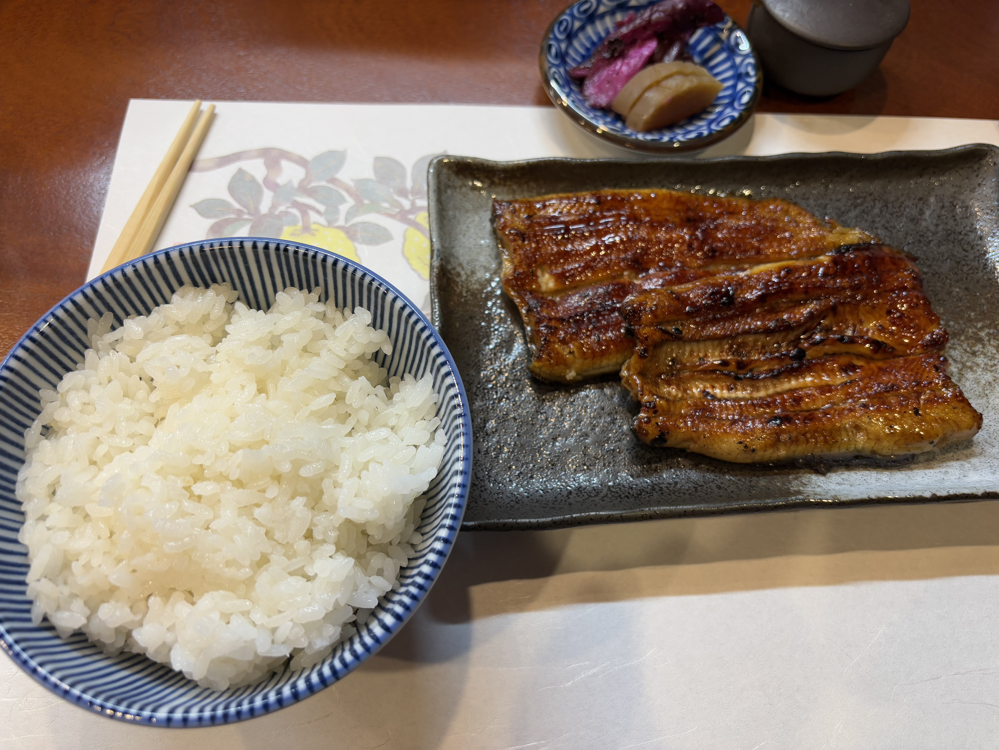

## 清晨的富士山
### 早饭：房东大姐姐的早餐
- 今天按照计划5点半（划掉，5点40）起床，不过起来了之后没有跟房东大姐姐说而直接去刷牙洗脸了，结果就是我洗完了才开始做早饭，于是我就简单收拾了一下东西，不过这样出门就6点多了，感觉稍微有一丢丢晚。
- 早餐很好吃！虽然来了之后更想吃日式的，还问了问房东附近哪家早餐好吃，但是看了一眼11点才开门这真的是早餐吗。。。既然决定5点半起床了就在房东家吃吧！炒蛋里的黄油加的非常慷慨，非常香但是内心隐隐约约有一点罪恶之感。吐司同样是加油烤过的，里面加的是烤熔的芝士和火腿片，啊真香啊，像是黄油和蛋白质在嘴里开party。左边的面包也有黄油或者果酱抹着吃，不过已经足够罪恶了就就着炒蛋吃吧！
### 再访河口湖
- 早饭之前问了问其他租客，说建议在湖北侧去看，然后我吃完早饭之后才不紧不慢的出发；但是出了门之后我立刻开始着急了，因为朝霞的第一抹红色已经涂在富士山的雪顶上了。由于折射的缘故，这第一缕玫瑰红非常鲜艳，让我心里忐忑不安：”这是不是就是说的粉色的富士山呢“？因为心里太着急了，而相机在包里、手机正卡在橡胶支架上在导航，所以我甚至没有拍一拍这精彩的照片。现在回想起来，心里非常后悔，我无从知道所谓粉色的富士山是不是我当时出家门回眸的那一眼了，今天骑车骑到了再看到的富士山与那一刻也全然不同，那一汪朝霞晕出的红色倒成了我心中的白月光了， 让我久久不能忘怀，以后和小明再来的话我要4点拉她起床来看！
- 骑了十分钟之后我就醒悟了，不能因为赶时间就放弃拍照。说起来原神里还提到过，终点不意味着一切，不要为了终点而忘记了旅途本身的意义。所以当我骑到河口湖大桥上、再次看到那轮昨晚我蹲在湖边咔咔拍的月亮的时候，我短暂顿足、欣赏了一下晨曦中圆月在湖面泼下的一片金光。
- 骑到对面就是咔咔拍富士山了。我回到了我见到的第一个七福神寿老人的古贺正男纪念公园，正好那边可以一直走到湖畔，视野更加开阔。一会拍几张照片一会拍几张照片，陆陆续续拍了不少。太阳逐渐升起，富士山的山顶的颜色逐渐从粉红转橙再转黄，最后变为纯洁的白色；背景晨曦的颜色也从黎明时的普鲁士蓝渐渐亮起，被晨曦渐渐染成了浅黄色，再到雄鸡一唱天下白，天就亮了
## 富士吉田市

### 新仓富士浅间神社⛩
- 天亮起来了，拍完了了早上的富士山，思考了一下要不要回去睡大觉呢，但是好像也不那么累了，那干脆直接进行后面的行程吧！这个神社在富士吉田市，它有一个展望台坐落在正对着富士山的一个山坡上，因此看富士山的风景非常非常好。
- 河口湖北侧和富士吉田市之间隔着一座小山，我本来以为要先过桥去河口湖南侧，但是一看谷歌地图才发现原来是有一条小岛可以穿山过去的，欣然起行。然而我并没有注意到这条路在谷歌地图上意外的直——我以为是山谷小路结果是一条隧道。不过这个隧道口还专门写了是有步道给自行车的，非常人性！
- 进了隧道空气不算特别好，不过也就两公里路不算太远。车骑起来好轻松啊，好轻松好轻松啊都不太用蹬就能自己走……嗯？等一下这不河里，我是不是一直在下坡……然后我就一边享受着一路下坡的真·自行车一边担心我是不是回来的路上要骑两公里的上坡，走完了长长的隧道

- 穿过长长的隧道，就到了富士吉田市。在这座小城里，随处都能看到近在眼前的富士山。新仓浅间神社在北侧的山脚下，神社不大，但是旁边所谓的新仓浅间公园是由神社打理的，包括一个很漂亮的展望台和一大片樱花林，当然我去的时候只能看到一大片光秃秃的山坡就是了。。到神社的时候还不到早上八点，四周几乎没有什么人，不仅没有游客，连神社的商店也都是关着的，非常冷清。
- 从神社上到展望台有390多级台阶，拾级而上还是挺累的，走一小段得休息一下。好在长长的楼梯正对着富士山，每次休息的时候都可以转身拍照，不显得我在楼梯边上呼哧呼哧很丢人）
- 爬上山顶，有一座红色的小塔，颜色很鲜艳。如果是樱花季或者枫叶季，富士山、宝塔就会和擅上成片的樱花或红叶相映成趣，平添积分色彩。虽然现在是冬天了，不过感觉光秃秃的树也并不只剩肃杀之气。冬天凉凉的空气吸进肺里，令人心情舒畅，有一种天朗气清的感觉，让我回想起了高中时天还未亮我就早起出门的感觉，想起了摇曳露营第一季的那首「ふゆびより」。这首歌的氛围和我前一天骑车环湖和今天早起看日出的氛围实在是太契合了
  
- 下山的时候人渐渐多起来了，有一些游客像我一样开始哼哧哼哧爬山了，哼哼，但我现在是在下山，于是洋洋自得地开始闲庭信步。山脚下的神社也有了人气了，能看到很多巫女在打扫庭院的卫生，商店里还坐着画御朱印的巫女。我第一次看到真的巫女诶！上白下红，是经典的巫女服，配色都透着一股和风。神社的宣传里面又有一个收集类的：富士五湖这边总共有7个神社，大家可以去这些神社求神玉，最后可以穿成一串。神玉也要花钱，御朱印也要花钱，想了一下还是算了不要搞了，每个地方求个御朱印加在一起不少钱呢。

### 下吉田駅
- 在新仓浅间公园的展望台小坐了一会，打开谷歌地图小查了一下接下来去哪。好在有房东大姐姐的谷歌地图的列表！打算从北到南直接骑车穿过富士吉田市了
- 骑车走在富士吉田的小路上，走着走着，突然发现一个车站，原来我到了下吉田车站，真是得来全不费工夫！本来我只想着盖个河口湖的印章就行了，既然走到这了那我就把下吉田的印章也盖了好了。盖了第二个了就想继续了，然后一看地图，喔原来这边是旅游区大家离得都挺近的的~那这下好了，一口一个这边的印章我要包圆咯~
### 下宫小室浅间神社
- 从一个浅间神社出来就到了另一个浅间神社—— 下宫小室浅间神社。这家神社也没有很大，走两步就逛完了。神社旁有一个碑还是挺有意思的，是明治三十七八年的阵亡将士纪念碑，碑文是用中文写的，因为那个时候比较正式的文章、经文都是用中文。查了一下，这是20世纪初的日俄战争，日本这边叫做日露战争。这块碑文我看了半天才看明白，原来那个时候的”老“就是现在的”露“，也就是ロシア，涨知识了。
### 本町通り
- 下一站就是本町通り了，这是富士吉田的一条交通主干道。富士吉田这边几乎每条南北走向的大街都有非常好的富士山的景色，但是为什么偏偏这一条路成了网红景点呢？
  日川時計店好像是一家买钟表的，但我去的时候并没有开门。虽然这家店在小红书上大名鼎鼎，但是好像大家对这家店本身并不感兴趣，只是喜欢去那家店边上的十字路口拍拍拍而已。为什么偏偏是这个十字路口呢？这个问题看了谷歌地图心里就会有答案了——这条路在这个路口方向有一个折角，让大家不用走到马路中间就可以拍到富士山挺立在道路两侧的复古店铺之间。但是即便如此，还是会有疯狂的游客想在马路中间拍照，甚至因此这个路口专门有很多负责管理治安的人员。我去的时候还有一对情侣居然想在马路中间支三脚架，被边上管理的大爷大声斥责”NO！
  “，看上去好像是中国旅游团里的人，感觉有点丢人）
- 顺着本町通り继续走，就到了金鸟居。乍一听以为是金阁寺那样子金光灿灿的样子，走近一看好像就是普通的木头，可能局部有包金所以叫金鸟居吧。鸟居一般是出现在神社大门口的，这里并没有一个真的神社，但是由于富士山受人尊敬，整个富士山就像是一个巨大的神社，而这个鸟居就好像富士山山神的神社的大门。所有来富士山的登山客，都要穿过这座鸟居，再开始爬山之旅。
- 金鸟居边上有一家药店，想了想要不要买维生素呢最后没进去。应该早买的
### 富士山駅
- 过了金鸟居，就准备吃午饭了。不过在那之前，快到富士回游线的富士山站了，这不得去盖个章！到了之后有点迷路，只找到了车站的后门，但其实没关系，只不过我当时还没有意识到……一般说来火车站的前门和后门肯定不是特别容易连通的，无他：中间有火车过你总得绕过去呀）但是我忘记了富士山站是个人字形铁路的车站，也就是说列车进站和出站是从车站同一侧走的！于是我从后门进来迈着迷茫的脚步然后发现走到了铁路的另一侧，一脸迷惑，赶紧头脑风暴了一下才明白过来
### 午餐：やぶ
- 这家店就是我问房东大姐姐推荐的「和食の朝ご飯」，其实人家11点才开门）因为今天出门早所以逛到现在才11点出头。趁现在时间早人少加上早餐吃的早，我简直就是个小机灵鬼
- 午餐这一套开始没整明白，点了个炸虾乌冬面，有个配菜叫做「半天丼」我没太看懂，上来之后发现哦就是天妇罗盖饭，可能只是比较少所以加了个“半”。不是哥们这真的能和腌咸菜放一行算配菜吗？
- 这家店不少大爷大妈来吃，我觉得来对了
- 炸虾很大
- 结账的时候属于是“我刚到日本，不熟地方”了，因为在东京有玉彬带着没怎么注意，这边结账从来都是拿着小票去「会計」，我还傻乎乎地跟服务员说check~
  
### 北口本宫富士浅间神社
- 看了看地图，南边还有个神社，看上去还挺大的于是决定虽然有点绕但是还是去看看吧！一路上是面对富士山骑过去，风景非常好。我走的不是本町通り，但是富士山一样就在道路的正前方。我不是很懂为什么大家全挤在日川時計店打卡，是因为两侧复古的装潢吗？
- 骑到富士吉田的南端就是这家神社了。这边因为有了近处的小山和植被，靠近之后就看不到富士山了，所以这边并没有新仓那边那么多人。
- 一进神社就散来一股冷气。神社的步道两侧是高耸的树林，确实是“隐天蔽日，自非亭午夜分，不见曦月”，颇有稻妻的镇守之森的感觉
- 神社门口的鸟居上写着「三国第一山」，我之前就在别的宣传册之类的地方听到了这五个字，还在奇怪富士山和三国有什么关系。看了介绍我才知道，这是在说这里的三国是中国（唐土）、印度（天竺）、日本，其中富士山是三国第一壮丽的山，well……
- 神社本店两棵冲天巨树。一棵叫做「冨士太郎杉」，树龄千年；另一棵是「冨士夫婦桧」，也是树龄前年。庙后面还有一棵「夫婦（めおと）うめ」，同根长出来的两棵树，挺有意思
- 地上铺的细细的石子里有几块大的，捡起来看了看发现上面布满气孔，是火成岩。不愧是富士山脚下
### 富士急乐园駅
- 回程第一个必去的地方是打卡车站。富士急乐园估计建在这里就是为了过山车的时候能看到富士山吧，而且这里还专门开了一个车站，可以说是大力发展第三产业了。这里的车站非常非常小，所以印章在乘务员那边，需要自己主动去问的。这也是我第一个主动问的车站，让我后面也都敢大大方方去问乘务员了。
- 可能是因为旅游区的原因？河口湖站和富士急乐园站的印章很大，华丽而精美，但是下吉田站的印章就很普通。富士山站的印章更是跟闹着玩一样，连印章上的字都已经变形了
- 回程的时候去看了房东专门发给我的一个位置，离富士急乐园很近，我就顺路去看了看。刚到的的时候还有点疑惑，原本以为是个咖啡店之类的，这里空荡荡的能有什么东西？后来一回头才意识到，这片空旷的停车场本来就是远眺富士山的绝佳地点，只遗憾远处的高压线稍微破坏了一下这里的风景。可能富士吉田这里本来就是随处是风景吧
### 大巴
- 一边看表一边往回走，眼看着两点的车赶不上了，那就不着急了，3点的车要赶就容易了，可以慢慢往回走了。——当时的我是这么想的
- 到家也就是两点左右，这怎么可能晚嘛！于是开始收拾东西。房东还提醒我记得线上买票，不然到时候排队人就多了，但是我试了一下还拜托房东试了一下发现不管用美国的卡还是日本的卡都买不了，只能线下买了。收拾完东西准备出发已经快两点半了，突然感觉不太妙
- 从民宿去车站走过去要20分钟，还好房东送我2点40左右就到了。路上还和大姐姐聊了聊。她是3年前从东京搬过来的（3年的房子还这么一尘不染好厉害），之前她还去中国旅游过，去过北京上海西安武汉，还去过黄山华山泰山，简直是旅游达人。我说我还是今年刚去的黄山另外俩都没去过）
- 我猛然想起来好像在网站看到了说买票必须开车前十分钟买，心里咯噔一下，这要是我自己走过来岂不是已经寄了。。。排队买票的时候确实有人排队，眼看着2点45了但是前面还有一两个人，我有点担心是不是线下也有这个规定，到时候要是排错队了就麻烦了；结果一问边上的售票经理她直接帮我插了个队买票，光速买完。这么一看的话可能确实我是极限操作了一波
- 大巴上别人都昏昏欲睡，上车就基本就东倒西歪了，就我一个人不知道为啥跟打了鸡血一样，左看看右看看，看到车窗外边出来了富士山就疯狂拍照，还挺快乐的
## 三岛
### 入住酒店
- 到了三岛站下车走不到十分钟就到酒店了，Dormy Inn三岛酒店。离开车站之前我还进站去找了一圈印章，不过没有找到，我当时还想是不是在车站里面。这就是经验不足啊）现在见得多了知道是全在外面的了
- 今天早上错过了最清晨的富士山之后，一直想要再看一次红色晕染的富士山，还琢磨了一下三岛哪里能看。后来一想酒店不就挺高的，车上看到小红书说酒店有房间可以看到富士山，我就期待了一下，结果到了之后发现并不是一个方向，于是只好放下包就去吃饭了。出了酒店刚走了两个路口我就越想越觉得，好不容易来一趟，至少也要搏一搏单车变摩托！于是我就再折返回去用日语问了问「富士山を見える部屋に変わって　の可能性があってかな〜」差不多的这样，一边往回走一边琢磨用词，然后成功换房！开心！感谢前台店员！
- 入住的时候他们日语说太快了我就改说English了，结果由于日本人英语太过捉急，我发现他们的英语说不好比日语还难懂，所以后面交流我就只用日语了）
### 晚餐……之旅
- 鳗鱼店是之前就在小红书看好的，走过去需要20分钟左右。我从酒店出来换房之后就从天擦黑变成完全黑了，我就挂着相机在夜晚的三岛闲庭信步，是在美国完全没有过的体验呢）
- 玉彬说三岛这种村里的鬼地方你晚上见不到一人的，确实。最大的大路上还是一直有很多车的，但是你只要拐一个弯就再也见不到人了几乎，但是家家的灯火几乎都是亮的。在小城里溜达别有一番风味。
- 相对繁华的大街旁有一家小小的神社，二之宮淺間神社。神社里静悄悄没有一个人，虽然离街不远但是显得非常静谧。神社里的一小块空地上有一个巨大的凤凰的展架，在昏暗的灯光下的仪态显得令人敬畏。神社正殿边上还有一个小鸟居还能继续往里走，应该是还有一个小神龛，但是里面实在是太暗了，晚上到访神社本来就格外有一种肃穆之感，再加上又是阴暗的小路，最后我没有进去，落荒而逃了
- 神社对面是一个小公园，白滝公園。一进公园我就看到了标识牌写着“小心地上裸露的熔岩！”。我还在琢磨，熔岩这个日语是什么意思呢……想了想也没想明白，查了一下也没什么特别的额外意思，一脸迷惑。等我走了两步才发现，原来真的是熔岩！准确的说应该是火山石，或者说火成岩或者说玄武岩，作为富士山脚下的城市，这个小公园用了大量本地的火山岩，别有一番趣味。小池塘里还有几只鸭鸭在睡觉。还想白天再来一次！
- 去鳗鱼店的路上路过了一处居民区，居民区里面甚至有一条小溪，叫做蓮沼川。环境非常惬意，偶尔还能看到本地人在散步。小溪中间有几个小雕塑，小溪旁甚至还有一处像是古代捣衣的地方；溪流中有几只锦鲤，不知道是不是很多人喂，长得非常肥大。最令我惊喜的是一家小鸭子，一两只大鸭子带着几只小鸭子，在长长的溪流中长驱直入，而且小鸭子的方向和我的步行方向相同，就这样我们相伴而行，每过一个小桥它们就会消失一下，但是很快就又从桥东的另一边出来，值得依赖！
- 跟着谷歌地图的奇怪导航，我在一处不临街没什么的的地方告别了小溪和鸭鸭，走进了好像是一家寺庙的侧门。事后再在地图上看了看，好像是叫蓮馨寺。日本这边寺庙是会有墓地的，但因为这边不埋葬所以墓碑非常非常的密集。为什么谷歌地图大晚上的给我导一条这路，怪瘆人的
### 晚餐：うなぎいけだ
- 20分钟的路程并不算太远，但我左看看右看看走了很久。不过好在到了店里还是没有什么人。其实根本没有客人，只有三个店员，其中还有一个是打工的。总是在动漫里看打工这下终于看到真人了，我还寒暄一样问了问是不是在打工，感觉他和店员都很局促）不知道是不是日本人在这种店本身就不会寒暄，还是我问的太直接了不太礼貌显得他是新手。但是其实还挺明显的——边上的店员姐姐小声提醒他先倒水、拿菜单之类的，而且这个小哥手上还写满了字，感觉应该是小炒吧。
- 这边的鳗鱼贵起来了，我点了一份推荐。因为有点紧张并且是英文菜单，我挑蒲烧还是白烧的时候，我没有转过来shirayaki是白烧，所以脑子稍微一宕，就直接选了熟悉的kabayaki，其实转念一想还是挺想试试白焼的。算了，去滨松再试吧，毕竟那边鳗鱼质量也好（spoil alert，没吃到。。。）
  
- 晚上吃晚饭之后又慢慢逛了逛回了酒店，还回去看了看那条小溪
- 回去的时间可能是中学生放学的时间，路边看到了很多放学的学生。在全家看到了两个男生在看周刊漫画有没有更新，在车站前看到了两个jc一个拉着另一个进了一家甜甜圈店，在公园逗留的时候看看到了一条小河对面一对情侣坐在湖边暗淡的灯光照不到的阴影里，我又觉得年轻真好了。
### 回到酒店
- Dormy Inn酒店，我之前选的时候还纠结了一下，是来这家还是去另一家价钱便宜1/3的酒店，但是最终觉得免费温泉免费拉面还是很吸引人的，还是享受一下吧！
- 回到酒店之后，看了看酒店给的泡温泉须知，还打开小红书仔细研习了一下泡温泉的流程，基本看明白了，然后我就换上了浴衣上顶楼去洗澡泡温泉了。出门之前还记得拿上了一些硬币用来泡完温泉买不得不喝的冰牛奶！从电梯里出来东张西望了一下，然后就发现了一整面墙的漫画书！OHHHHHHHHH真好啊真好啊，有地。、巨人、天麻等等等等，真好，泡完温泉就来看吧
- 进温泉之后先脱衣服锁到柜子里，然后就拿着从房内带来的毛巾去洗干净身体。因为是日本特色我还体验了一下坐着洗澡。除了淋浴喷头还有一个水龙头，上面有一个大大的PUSH按钮，工作方式和餐馆里的倒茶机一样，按一下会定时出水，出的水刚好够装满了边上放的一个盆——就是动漫里见到的那种接满一盆水然后从头上倒下去那种。见到真的了，dokidoki！盆里的水仔细一看有点浑浊，看来是温泉，用来洗完澡之后先用温泉浇一下给身体来个真·预热
- 泡温泉的时候据说毛巾放到温泉里是不礼貌的，我就学着边上的大叔把毛巾系头上了。温泉水很热很热，就好比下游泳池的时候要慢慢下去不然太凉身体不适应，下温泉的时候也得慢慢下，真的很烫
- 说温泉能看见富士山，打扰了。一是晚上确实不好看，二是现在是寒冬，温泉的水汽哈在窗户上别说富士山了，对面街的广告牌都看不清）
- 进了温泉不知道该泡多久，我看网上说二三十分钟然后进来之后根本就没有概念……小红书说有的地方会给个沙漏来看时间，真的是非常贴心了。边上的大爷没有泡多久就出去了，我还以为是很讲究的泡一会歇一会回来继续，不过好像他就是离开了。我觉得离20分钟还早就又坐了一会，但是感觉起来也没泡多久我就担心自己是不是不行了，最后体感泡了十分钟就出来了吧，出来之后感觉有点晕晕乎乎的，手指末端也有一点点发麻，可能再泡久一点就不好了
- 温泉边上还有桑拿，我还没研习流程最后就没去
- 泡完温泉拿清水冲一下身体就可以出去了。温泉确实有一股奇妙的味道，洗完澡身上也留下了一点，可能是因为硫元素？游泳池出来身上是氯的味道，这下duality了
- 泡完温泉买了一瓶meiji的~~武藏野~~牛奶，小小的玻璃瓶感觉很有那味。拿了《地。关于地球的运动》的第一卷，坐在自动贩卖机前边喝边开，好不自在~不由得拍照给小明给jw给cjh给玉彬给傻子群全发了一遍。泡完温泉还有免费的冰激凌吃，但我乖乖、没有吃！
- 漫画区写着每次最多拿5本回去，开心拿了一本《地。》还拿了一本《天才麻将少女》的第一卷回房间。不过两个都看了一下发现天麻相比之下还是稍微有点难懂了
- 看漫画看到累了，就到了9点半之后了，拉面时间！这家酒店9点半之后提供“清淡”夜宵拉面，这不得下去尝尝！我穿着米奇的背心短裤就出来了，出来之后才意识到餐厅在一楼，一楼有大门和外面连通说不定会很冷，好在下去之后还好。餐厅里已经几乎座无虚席了，其中有很多穿着浴衣的大爷们。拉面味道还不错，说是清淡但是我吃着还是很咸，心想也可能是缺水吧跟嘴唇干裂可能很有关系；后来我仔细一想才意识到，相比于面屋武藏的那个厚重的豚骨堂汤底，这个是清汤确实清淡一点——不是咸淡而是油脂层面