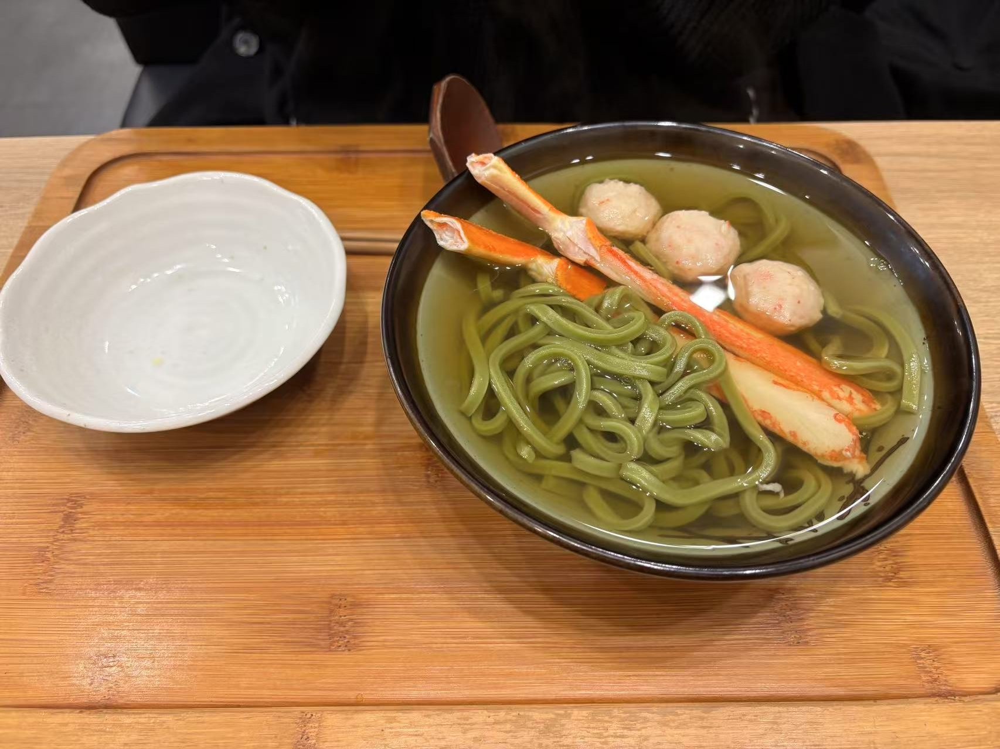

## 去宇治站
### 早餐：鲷鱼烧
- 本来计划早早出门的，不过随便拖拖就晚了。看到了早上出门去车站路上有一家鲷鱼烧，但是10点才开门。我们希望了一下赶不上，不过最后从酒店出来的时候已经10点多了）
- 吃了一个红豆的一个custard的，尝了尝我觉得还是原本的好吃，亏我们还为了后者等了10分钟
### JR转近铁奈良线
- 走到大阪站还是得走一段，然后先坐铁路到京都再下来到宇治。说是“坐”，然而根本是站着去的，而且因为京都很多游客，所以去的路上人挤人，还好是快急更快一点，不过还是很受罪（我还花时间研究了一下要不要买特急券，幸亏没买
- 坐奈良线的时候我还吓了一下心说不会去奈良还要再来京都一趟吧，后来才发现还好是走南边更快一点
- 奈良线上有一站是“稻荷”，哗啦啦下去一片人，一下就有坐了，我很开心。看来大家都是去稻荷大社的，仿佛看到了几天后的自己
### 宇治站
- 在大阪忘记盖章了，最后也没机会去盖了，下次一定！但是来宇治可算想起来了
- 宇治站门口有一个油桶是一个茶叶缸的形状，非常可爱
- 简单逛了一下宇治的观光案内所，还有意外收获！发现了京吹的立牌，还有京阿尼的原画展板，泪目。虽然京吹三寄了但是还是应该补一下京吹的。可惜这一次没有机会去看一看业界良心京阿尼的楼，希望未来有机会
## 抹茶一条街
### 抹茶伴手礼店
- 抹茶一条街顾名思义就全是买抹茶产品的，其中又以几家店格外有名——伊藤久右卫门、辻利、中村什么什么的。店中主要就是茶叶、抹茶、抹茶点心。先看好了几款，我们回来再收缴
- 喝了喝用来品尝的茶，确实味道还不错，不过是偏绿茶的口感。最后买了加抹茶的玄米茶，感觉很有日本特色）
### 平等院
- 作为玉彬推荐的日本硬币背面的图案，还是去看一看吧，毕竟离得很近了
- 犹豫了一下是先吃饭还是先去逛平等院，最后发现没有什么好犹豫的因为根本没什么地方能吃饭，全要大排长队。因为我们下午晚些时候还要去逛任天堂博物馆，所以比较赶时间根本没工夫和游客们大排队。我原本是想11点就吃饭的，这样说不定可以错峰，但是因为出门晚了、火车又很慢，最后该吃饭的时候就已经12点多了，到处全是人了
- 平等院还要门票，不过回想了一下旧金山那个小小日本园林都要十几刀，这几百日元属实是无所谓了
- 夏威夷也有一处平等院，张学良的墓就在边上；宇治的这家估计是原版，一样也是清水潭之上有一座红色的寺庙。天朗气清，红色的建筑和倒影与湛蓝的天空相得益彰，颜色一撞颇为活泼。
- 正殿可以付费进去听讲解，不过我们赶时间就没有去排队。不过后来在小红书看发现很多人说不会日语的话就是纯去罚站）
- 除了正殿边山还有一些小的建筑，不过同样是因为赶时间所以也没有细逛。看到了一块石碑，不知道是在纪念谁，里面开头写了什么“知命者不立于危墙之下，所以死之重于泰山者也；君子杀生成仁也，所以生之轻于鸿毛者也”，感觉不错可惜没时间细看了
### 宇治川
- 从平等院的表参道出来，仍然没看到吃饭的地方，不过走到了宇治川边，令人神清气爽。密码正确白菜很是开心
- 河边有一个紫式部的小小的塑像，我还是从fgo中知道这位源氏物语的作者的。边上有一小株红叶尚未完全褪色，配上背后的蓝天和宇治川，还是很好看的
- 走进河畔，边上有一家日本人在拍照，看样子也是游客。我和白菜沿着河畔走了走，拍了几张照片。如果有时间的话感觉在便利店随便买点然后坐在河边吃也不错~
### 午餐：はなれ中村製麺 - 抹茶面
- 找寻午餐的路可太难了！不仅要考虑排不排队，更重要的一点是我身上的现金只有3000出头了，而宇治不像东京大阪那么繁华很有可能是吃饭必须要现金的，令我很是紧张
- 逛抹茶一条街的时候就看到了这家，排队的人不算多而且也支持visa卡，很不错。不过还是打算去提前看好的一家店去看看。
- 提前看好的那家抹茶面比较偏僻，要从抹茶街侧面走出去一段。跨出游客街之后里面感觉像出了结界一样，立刻就变冷清了，变成了一般的日本乡村的景象，很像我之前在三岛见到的风情。街道上一尘不染，非常非常干净，见不到一片垃圾，令人惊讶。街道窄窄的，感觉甚至不够两辆车错车而过；街道两侧是日式的住宅，还有林立的电线杆，撑起的电线把头顶的天空划成了一块一块，让我想起了之前看到的一张图，给每一块天空染上一天中不同的色泽。路旁的告示牌上贴着一些些宣传海报，还有哪天收什么种类垃圾的表格，实在是太经典了。
  白菜在这个环境里非常兴奋，毕竟是非常有日本特色的乡村景色，但是我前面一周走了很多很多这样的路，从东京的居民区到河口湖到三岛滨松丰桥，现在已经见怪不怪了，嘻嘻
- 离店家还有几十米的地方，隔着一条小马路就能看到远处聚集着一群人，心里不由得咯噔一下，感觉像是在排队啊。走近一看果不其然，有十来个人在排队，我们直接知难而退了
- 第二家准备去店在平等院的表参道上，边上有一条窄窄的楼梯通到二楼的入口。我都开始上楼了被白菜叫住，说这家是cash only，吓得我赶紧又转身下来，这时候偏偏二楼的服务员还拉开门说いらっしゃいませ〜，吓得我连连道歉然后回到门口继续看它写了什么
  仔细看了看发现他们家的当日套餐点两份的话，钱是够的！不过说是够的，其实是我的3000多现金算上所有的零钱加在一起，吃完剩下不到100）不过确实是饿了所以要不就在这里吃吧！我就继续上楼，快爬完楼梯的时候发现二楼贴着一个“年末12月28号-xxxx额外收取10%的服务费”……好，这下真不够了，快撤撤撤撤，于是我又折返下来惊慌失措地跑掉了，btw转身走了两步服务员又出来了让我又不住地道歉）
- 走了两步还看到了一个ATM，这不就有钱了嘛，这下可以安心吃饭了！走近一看发现这破玩意居然周六中午12点关门周日不开，我们晚到了20分钟。也不知道ATM一个自动的机器有什么好休息的，令人迷茫
- 没饭吃只好去逛平等院，逛完出来更是有些店都关门了。逛了一大圈之后我们又回到了最开始看到的抹茶面店，排队只排了十几分钟就进去了~而且排队的时候我还研究清楚了一会去任天堂博物管的路线，四舍五入就是一点都不耽误！

### 购物与抹茶甜品
- 午饭之前看到了超市Appro，一进去感觉就是普通的超市，不过有一个货架上全是宇治抹茶联名的各种零食，买了非常便宜的kitkat和meiji巧克力用来送人，真是太方便了）
- 午饭其实也可以放弃这边去任天堂博物馆附近再吃的，只不过因为还惦记着抹茶甜品，还是先在这边吃完饭比较好。因为刚刚吃完午饭，最后只点了一份抹茶拿铁，稍微有点甜不过总的来说还不错~ 话说为什么服务员小姐姐一开口就知道我是中国人然后跟我说中文呢
- 今日最佳！取餐的时候，店家居然还送了我们一个比拿铁还贵的甜品?! 这下可以尝尝一路上总见人吃的那个看上去很豪华的一坨是什么了！这是一个用杯子装的可丽饼，中间分为三层，最下面是抹茶冰激凌，中间是奶香味十足的奶油，而最上层是像压饸饹一样压出来的抹茶酱。抹茶酱微微有点苦，和下面的奶油一起吃相得益彰。开始的时候冰激凌被盖在下面看不太出来，等上层吃了一部分之后才慢慢露出来，冰冰的和上层口感相异，仿佛是努力吃完上层的奖励
- 一边吃甜品我们一边买伴手礼。因为时间已经来到了3点半，而博物馆6点就要关门了，所以我为了赶时间就决定分头行动，我先去拎一部分东西排队，让白菜再去拿一些别的小零食。买完之后的时间果然非常完美，刚好赶上半个小时才有一班的公交车~ 因为我已经看了很多遍地图，所以连在哪坐公交都已经烂熟于心，最后刚确认自己来对了地方之后公交车就来了，可以说是非常非常nice timing了。
## 任天堂博物馆
- 其实我们这几天的行程不那么河里，宇治离京都很近，所以宇治和京都的行程应该放一起的。但是博物馆的票很难抢，提前几个月就已经定好了的，然后又想在京都跨年，这下就没办法了）
- 进博物馆居然还要存包，然后存包柜是一个很神奇的要交100日元押金的自助装置。硬币投入就可以拔钥匙了，把钥匙再插回去钱就又自己掉出来，我觉的很好玩
- 公交车上白菜还说了一句我们没有选头像，我还疑惑了一下为什么要选头像）原来每个人都会制作一张通行卡，上面会印着你选择的头像，我们没有提前选好于是双双印着马里奥，嘛倒也不错就是了，虽然如果真的有机会选的话我就选卡比了
### 二层 - 任天堂的历史
- 博物馆正馆总共两层，上层是从上世纪五六十年代以来的任天堂的各种各种产品，下层是一些游戏的试玩。正馆之前的路上还有很多可以合影的地方，还有工作人员引导排队并且帮忙拍照，感觉确实非常有成熟旅游业的感觉
- 不看不知道，原来任天堂那么早就开始做各种产品了。当时还没有各种电子产品，所以最开始还是各种桌游以及一些奇怪的设备，比如光线电话光线枪什么的，这些技术层面应该不是很复杂，但是能作为娱乐设备实现出来确实展现了老任家无穷的创造力。边上还有小电视放着当年的广告，看上去非常炫酷
- 白菜不久之前刚刚去过上海的游戏博物馆，学习了很多游戏科学的相关的背景，对这方面比我还要熟悉，看到老任家的种种非常兴奋。有机会我们再一起去逛一遍上海的游戏博物馆吧！
- 在逛任天堂的发展历史中，我们最常发出的感叹就是，“啊？原来这个时候就有这个了啊”。老任把科技转化到游戏设备的理念是一流的，所以我们经常看到很多以为是很近代的技术结果老任几十年前就用了
- 想起了之前看到的网友的一句：“打游戏。这世界上有顶级文学作品改编的游戏，有程序+音乐天才自制的游戏，有突破第四面墙的超越游戏，有世界一流影视公司制作的震撼游戏，也有让你在赛博世界坐在无人岛度假的游戏，也有简单粗暴但可以让你和朋友乐一晚上的互动游戏，只要你别再把手机上那些抄袭来的诈骗软件称为游戏了”
- 展览还有很多很多卡带的陈列，但是因为我们都没有怎么玩过所以并没有去仔细看，主要是把时间花在了看游戏设备上
- 最后还有一个老任家经典游戏的迭代进程，包括历代马里奥、赛车、星之卡比、宝可梦、塞尔达、etc.的演示，可惜没有时间仔细全看完了
### 一层 - 游戏体验
- 因为礼品店5点45就要停止进场，所以出来我们就只有15-20分钟来玩了。每个人有8个金币可以体验游戏，但排队的人很多所以我们决定挑一个玩玩差不多了
- 排了一个开枪打大屏幕的，稍微有点像我们之前在环球影城的马里奥世界玩的一个。可以选枪还是炮，那肯定扛火箭炮啊枪多没意思。经过三轮浴血奋战，我击杀数成功拿下组内第三名，开心！
- 临走逛了一圈，看到了一个测love的机器，其实是双人体感游戏，中间还被机器拍照了而且可以直接回去官网查看，好方便好人性
- 虽然游戏以及博物馆做的都挺好，但是老任的博物馆礼品店属实是有点拉，转了一圈也没几个好看的。另：日本人是真的喜欢盲盒啊
## 归程
### 返程：小仓 - 近铁京都线 - 新田边/京田边 - JR东西线/学研都市线 - 北新地
- 天才！真的是天才！规划出这条路线的我实在是天才！
- 从任天堂博物馆的礼品店出来，正好是博物馆的关门时间，人群熙熙攘攘地出来，宇治小小的街道上全是游客，大家慢慢悠悠的走到了附近的小仓站。望着拥挤的街道、小小的站台、以及谷歌地图，我突然计上心头，准备剑走偏锋，放着最快的线不坐，去挑了一趟绕远的线坐了
- 之所以挑了绕远的线，是因为本来的最优路线是原路返回在京都换乘，但是早上的惨痛经历已经让我们见识到了京都的游客有多多了，那当然是要避开啦。所以我们不仅不在京都换乘，我们近铁京都线的方向甚至是要往远离京都的方向走，人自然就少了~
- 小仓站不是一个很大的车站，甚至没有站楼，两边站台的进站口也是分开的。可以看到，大部分人群都是挤去往京都方向。到了站台上，可以看到对面的站台简直是人挤人，而我们这边十分冷清，顿时觉得自己做了一个正确的决定
- 果不其然，这个方向的车基本上是空车，而且几乎全程是空车，一排座上往往只有一个人，非常空旷，舒坦~
- 车上查了一下才发现了我这个计划有风险的地方：要换乘的JR东西线要半个小时才有一班，而我们到换乘站之后五六分钟之后18:46就有一班，也就是说如果错过了的话就要再等半小时了！拜此所赐，我们下车就开始小跑，一边找路一边冲刺。因为近铁站和JR站并不在一起，中间还隔着一个停车场，吓得我们急急忙忙跑过去，提前了一两分钟18:44赶到了站台，中间甚至都没有来得及找盖章点，呜呜呜）
- 走到站台上，一侧的站台上正停着一班车大敞着车门，但是车上的字看上去像是终点站，和谷歌地图上说的终点站好像并不一致。但是由于急急忙忙赶过来，我也已经转向了、已经找不着北了，完全不能确认是不是要坐这一班。怎么办！眼看着车可能就要开了，到底要不要上车呢，上不上呢，上错了就麻烦了，但是不上真错过的话又要等半小时才有一班那可就累人了
  在焦急地打开指南针的过程中，我意识到了在这边的这趟车可能并不是要开车了，只是开着车门在等待发车时间。眼看着18:46就要到了，我又急中生智决定先登上现在车门大敞的这班车：因为我猜测两班车在这种小站台不会设计在真的在同一时间发车，如果真的上错车的话那既然这班车不发车我们也可以下车去对面，而如果这班车就是要马上发车的话也不会错过！果不其然，我们前脚上了停着的列车，后脚站台对策就来了我们再等的列车，终点站名字也与谷歌地图相吻合，nice！顺利换车，丝滑空车落座
- 日本很多地铁都是布座位配加热座椅。确实做起来比硬邦邦冰凉凉的大金属板子要舒适一些，但是暖风吹的人晕晕乎乎的，让人有种缺氧般难受的感觉。加上我们俩饥肠辘辘，坐着好生难受，靠站的时候从车门出来的寒风倒反而更加舒服让人有点神清气爽的感觉
- 虽然小仓和京田边都没时间盖章了，但是从北新地出来这下我可有时间了！哼哼
### 晚餐：拉面 神虎
- 为了节省时间，我说服了白菜先顺路吃饭，再回酒店~ 正好白菜的必吃列表上有几家寻常百姓家的菜，今天晚上就挑一家好的拉面吃吧！
- 拉面店日本自然是不缺的，在地铁站和酒店之间我们很轻松地找到了几家评分都挺高的店——在地图上找到的。等到了之后我们望着简洁的写字楼，沉默了一下才意识到哦原来店面在地下
- 这家拉面的点餐是非常经典的店前点菜、拿餐券、交给厨子的形式，而且这家和我之前去过的面屋武蔵一样，也是三种颜色的经典拉面，神虎黑虎赤虎，只不过这次黑虎他们没有用墨鱼汁了
- 国内也有卖日本拉面、美国也有卖日本拉面。之前在科大的时候，就去cb点过拉面，还觉得有点贵但是挺好吃，甚至汤的味道也不错直接几乎能一勺一勺全喝了，尽管稍微有点点咸但是也没有那么咸一会多喝点水就行了毕竟好喝。来了日本之后，真正理解了所谓豚骨拉面的含义，豚骨的酱汁是真的很浓郁，这个汤汁就远非能一勺一勺全喝掉的范畴了，一方面是咸，另一方面是也比较腻。虽然并不是上浮着厚厚一层油，但是这个酱汁确实应该混合了不少油，吃多了的话确实是比较顶的
  另一方面其实这也解释了另一条赛道——蘸面。之前就听So说过蘸面，我还以为是拌面，其实是不一样的。之所以没能在之前理解蘸面，就是因为之前在中国美国吃过的拉面酱汁都不够浓郁，而如果酱汁不够浓的话显然面条蘸着吃就太保守了，味道会过于寡淡。而如果是正宗一点的日式豚骨汁，就完全不会有这种问题了
- 晚上回酒店的路上又路过了一下那个繁华的烧肉酒场一条街。第一天太饿了也没工夫东张西望小姐姐，这次路过简单看了看感觉可能也没几个好看的）